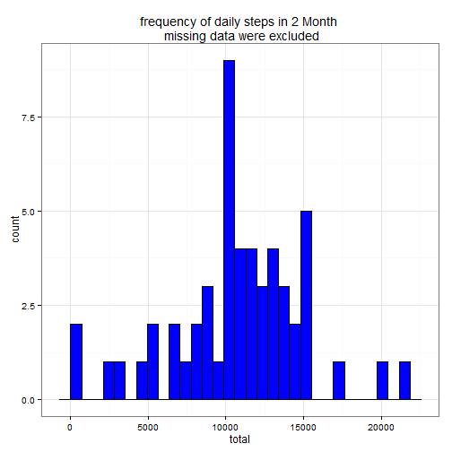
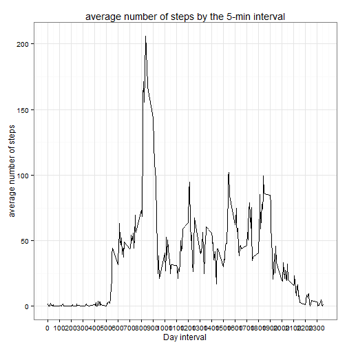
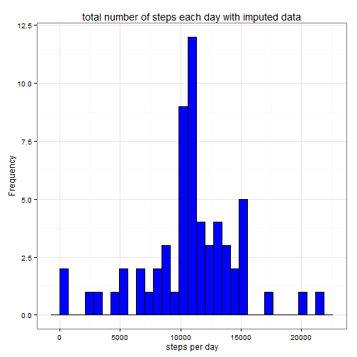
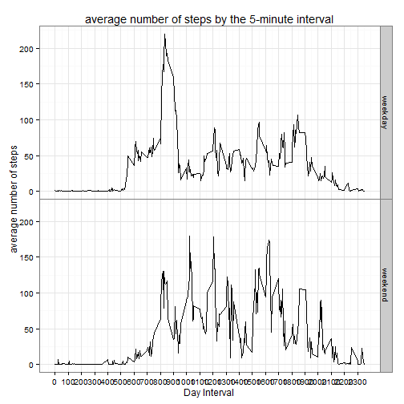

Reproducible Research: Assessment #1
======================================
load the R packages


```r
library(knitr)
library(ggplot2)
suppressPackageStartupMessages(library(grid))
theme_set(theme_bw() + theme(panel.margin=unit(0,"lines")))
suppressPackageStartupMessages(library(dplyr))
opts_chunk$set(echo = TRUE)
```

set up working directory

```r
# set up working directory
setwd("C:/Study Documents/Z_The Data Science Specialization/5_Reproducible Research/Peer Assessment_1")
```

##Loading and preprocessing the data
Show any code that is needed to.  <br />

1. Load the data (i.e. *read.csv()*)

```r
# load data
data <- read.csv("activity.csv")
```

2. Process/transform the data (if necessary) into a format suitable for your analysis.

```r
data$steps <- as.numeric(data$steps)
data$date <- as.Date(data$date, "%Y-%m-%d")
# str(data)
# print out first 20 rows
#head(data,20)
```

##What is mean total number of steps taken per day?
For this part of the assignment, you can ignore the missing values in the dataset. <br />

1. Calculate the total number of steps taken per day.

```r
steps_day <- data %>% 
   group_by(date) %>% 
   summarise(total = sum(steps))
```

2. If you do not understand the difference between a histogram and a barplot, research the difference between them. Make a histogram of the total number of steps taken each day.

```r
gr <- ggplot(steps_day, aes(x = total))
gr<- gr + geom_histogram(fill = "blue", colour = "black")
gr <- gr + ggtitle("frequency of daily steps in 2 Month \n missing data were excluded")
gr
```

```
## stat_bin: binwidth defaulted to range/30. Use 'binwidth = x' to adjust this.
```

 
3. Calculate and report the mean and median of the total number of steps taken per day

```r
meanSteps <- mean(steps_day$total, na.rm = TRUE)
medianSteps <- median(steps_day$total, na.rm = TRUE)
```

The mean of total number of steps per day is 1.0766189 &times; 10<sup>4</sup> and the median is 1.0765 &times; 10<sup>4</sup>. Both are farily close to each other.


##What is the average daily activity pattern?
<br />

1. Make a time series plot (i.e. *type = "l"*) of the 5-minute interval (x-axis) and the average number of steps taken, averaged across all days (y-axis).

```r
## create a new data frame with the average number of steps per interval
steps_interval <- data %>% 
   group_by(interval) %>% 
   summarise(meanSteps = mean(steps, na.rm = TRUE))

p2 <- ggplot(data = steps_interval, mapping = aes(x = interval, y = meanSteps)) + 
    geom_line() + 
   scale_x_continuous("Day interval",breaks = seq(min(steps_interval$interval), 
    max(steps_interval$interval), 100)) + 
   scale_y_continuous("average number of steps") + 
   ggtitle("average number of steps by the 5-min interval")
p2
```

 

2. Which 5-minute interval, on average across all the days in the dataset, contains the maximum number of steps?

```r
# find row with max of steps
max_steps <- which.max(steps_interval$meanSteps)

# find interval with this max
max <- steps_interval[max_steps, ]
```

The interval of 835is the interval that provided the largest steps of 206.1698113.


##Imputing missing values
Note that there are a number of days/intervals where there are missing values (coded as *NA*). The presence of missing days may introduce bias into some calculations or summaries of the data. <br />

1. Calculate and report the total number of missing values in the dataset (i.e. the total number of rows with *NA*s)

```r
sum(is.na(data$steps))
```

```
## [1] 2304
```

2. Devise a strategy for filling in all of the missing values in the dataset. The strategy does not need to be sophisticated. For example, you could use the mean/median for that day, or the mean for that 5-minute interval, etc.

Imputation function was created for replacing NA's with the mean for such 5-minute interval.

```r
###fixed imputation of single variable by the mean for that 5-minute 
imputedFunction <-function(X){
   Y <- X
   for (i in 1:nrow(Y)) {
      if (is.na(Y$steps[i])) {
      interval_value <- Y$interval[i]
      steps_value <- steps_interval[steps_interval$interval == interval_value,]
      Y$steps[i] <- steps_value$meanSteps
      }
   }
   return(Y)
}
```

3.  a new dataset that is equal to the original dataset but with the missing data filled in.

```r
###imputation
imputed_data <-imputedFunction(data)
```


4. Make a histogram of the total number of steps taken each day and Calculate and report the mean and median total number of steps taken per day. Do these values differ from the estimates from the first part of the assignment? What is the impact of imputing missing data on the estimates of the total daily number of steps?

```r
imputed_data_day <- imputed_data  %>% 
   group_by(date) %>% 
   summarise(meanSteps = sum(steps))

p3 <- ggplot(data = imputed_data_day, mapping = aes(x = meanSteps)) + 
   geom_histogram(fill = "blue", colour = "black") + 
   scale_x_continuous("steps per day") + 
    scale_y_continuous("Frequency") + 
   ggtitle("total number of steps each day with imputed data")
p3
```

```
## stat_bin: binwidth defaulted to range/30. Use 'binwidth = x' to adjust this.
```

 


```r
meanStepsImp <- mean(imputed_data_day$meanSteps, na.rm = TRUE)
medianStepsImp <- median(imputed_data_day$meanSteps, na.rm = TRUE)
```
With the imputed data, the mean of total number of steps per day is 1.0766189 &times; 10<sup>4</sup> and the median is 1.0766189 &times; 10<sup>4</sup>. 
Both are indentical.


###Are there differences in activity patterns between weekdays and weekends?
For this part the *weekdays()* function may be of some help here. Use the dataset with the filled-in missing values for this part. <br />

1. Create a new factor variable in the dataset with two levels - "weekday" and "weekend" indicating whether a given date is a weekday or weekend day.

```r
imputed_data$week_type <- ifelse(weekdays(imputed_data$date) %in% 
                                    c("Satuday", "Sunday"), "weekend", "weekday")
head(imputed_data)
```

```
##       steps       date interval week_type
## 1 1.7169811 2012-10-01        0   weekday
## 2 0.3396226 2012-10-01        5   weekday
## 3 0.1320755 2012-10-01       10   weekday
## 4 0.1509434 2012-10-01       15   weekday
## 5 0.0754717 2012-10-01       20   weekday
## 6 2.0943396 2012-10-01       25   weekday
```

2. Make a panel plot containing a time series plot (i.e. *type = "l"*) of the 5-minute interval (x-axis) and the average number of steps taken, averaged across all weekday days or weekend days (y-axis). See the README file in the GitHub repository to see an example of what this plot should look like using simulated data.

```r
steps_intervalImp <- imputed_data %>% 
   group_by(interval,week_type) %>% 
   summarise(meanSteps = mean(steps, na.rm = TRUE))

p4 <- ggplot(steps_intervalImp, mapping = aes(x = interval, y = meanSteps)) + 
    geom_line() + 
   facet_grid(week_type ~ .) + 
   scale_x_continuous("Day Interval", breaks = seq(min(steps_intervalImp$interval), max(steps_intervalImp$interval), 100)) + 
    scale_y_continuous("average number of steps") + 
   ggtitle("average number of steps by the 5-minute interval")
p4
```

 

